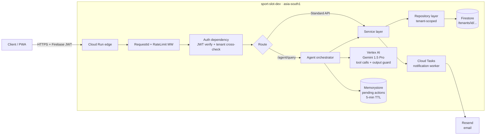

# SlotSense

Multi-tenant SaaS for Indian residential community sports facility
booking, with an AI booking assistant residents talk to in natural
language. Built by [Chandra AI Labs](https://chandraailabs.com) as a
production-grade reference implementation: every architectural decision
documented, every phase independently validated.

The repo name remains `sport-slot-reservation` (URL stability); the
product was renamed to SlotSense during Phase 9.

**Status:** Phase 9 complete — AI booking agent live on top of the
multi-tenant SaaS foundation. Phase 8 (production hardening: CMEK,
VPC, MFA, pen testing, DPDP formalization) is next, deferred during
Phase 9 in favor of the agent build.

## What this is

In Indian residential communities, booking shared sports facilities —
tennis courts, badminton courts, the cricket nets — is usually handled
through WhatsApp groups, paper rosters, or third-party operators who
take 50–75% of booking revenue. SlotSense is a multi-tenant platform
that lets communities run their own bookings, keeping the revenue and
giving residents a real product.

The differentiator is the AI agent. Residents can say "book my usual
tennis slot tomorrow" instead of navigating a calendar grid; the agent
proposes a structured booking with a confirm-or-cancel card, and only
executes when the resident explicitly confirms. The propose-confirm-execute
gate (see [`docs/adr/0023`](docs/adr/0023-propose-confirm-execute-gate.md))
means the LLM never directly mutates state — every action goes through
a structured pending action with TTL semantics in Redis.

For the full portfolio writeup of the architectural decisions and the
vendor-fee value proposition, see
[`docs/SLOTSENSE_ARTICLE.md`](docs/SLOTSENSE_ARTICLE.md).

## Capabilities

- **Multi-tenant by construction** — five-layer tenant isolation
  (deny-all Firestore rules, repository pattern requiring
  `TenantContext`, JWT-vs-subdomain cross-check middleware, automated
  cross-tenant tests, CI static-analysis gates)
- **AI booking assistant** — Vertex AI Gemini 1.5 Pro with function
  calling over 5 tools; propose-confirm-execute gate for all mutations;
  output classifier for hallucination detection; Python-side guards
  for temporal reasoning, quota arithmetic, and disambiguation
- **Per-tenant branding** — subdomain-based; each tenant's logo,
  colors, font, and footer applied via CSS variables
- **PWA-first delivery** — one codebase serves iOS, Android, and web;
  100dvh layout, 44pt tap targets, keyboard-aware flex
- **Production engineering posture** — 91%+ backend test coverage,
  branch-protected `main`, Workload Identity Federation for
  deployments (zero JSON keys), structured JSON logging, ADRs
  before code

## Architecture

The request flow with the AI agent path (Phase 9) added to the
original multi-tenant backend:



**Tenant isolation (ADR-0004), five layers:** deny-all Firestore
rules · repository pattern requiring `TenantContext` at construction ·
JWT-vs-subdomain cross-check middleware · automated cross-tenant
tests · CI static-analysis gates.

**Agent safety architecture (ADRs 0021–0027):** the LLM extracts
intent and proposes actions; deterministic Python validates and
corrects edge cases; a Redis-backed pending action store with 5-min
TTL holds proposals between propose and confirm; an output
classifier validates that entity references in the natural-language
reply exist for the current tenant, failing closed.

## Quickstart (local)

```bash
make install && make verify-env   # toolchain check (13 tools)
make dev-env                      # creates backend/.env from template
# → fill SPORTSLOT_WEB_API_KEY (Firebase Console → Project settings)
make seed-dev                     # demo Firebase user + profile (dev only)
make run-dev                      # uvicorn on :8000
TOKEN=$(./scripts/get_dev_token.sh demo-resident@chandraailabs.com '<password>')
curl -H "Authorization: Bearer $TOKEN" localhost:8000/api/v1/users/me
```

The full agent path requires a configured GCP project with Vertex AI
access, Memorystore Redis, and Cloud Tasks. Local development typically
runs the backend without the agent (the non-agent API surface works
independently).

See `docs/runbooks/local-development.md` for the full loop, frontend
setup, and known issues.

## Key documents

- [`docs/REQUIREMENTS.md`](docs/REQUIREMENTS.md) — canonical project
  scope, reconciled to actual state through Phase 9
- [`docs/SLOTSENSE_ARTICLE.md`](docs/SLOTSENSE_ARTICLE.md) — the
  portfolio article: architectural decisions, vendor-fee economics,
  what I'd reconsider with hindsight
- [`docs/adr/`](docs/adr/) — 27 Architecture Decision Records covering
  stack, data, tenant isolation, cost, API design, auth, booking
  domain, slot locking, audit, frontend, error presentation, admin
  identity, facility catalog, user provisioning, deletion lifecycle,
  CI/CD security, notification architecture, password policy, and
  the seven Phase 9 ADRs documenting the AI agent's safety
  architecture
- [`docs/retrospectives/`](docs/retrospectives/) — phase closure
  narratives. Phase 2 through 5 documented previously; Phase 9
  added during the recent closure ceremony. Phases 6, 7, and 8
  (deferred) are intentionally undocumented as retrospectives —
  see the Phase 9 retrospective's "honest reflections" section for
  why
- [`docs/security/charter.md`](docs/security/charter.md) — principles,
  threat model, phased controls, DPDP compliance, identity and
  credential model
- [`CHANGELOG.md`](CHANGELOG.md) — slice-level history with
  per-PR detail; the canonical record of what shipped when

## Stack

**Backend:** Python 3.12 · FastAPI · uv · structlog ·
zoneinfo (per-tenant timezones) · pytest with hermetic Firestore mocks

**Frontend:** React 18 · Vite · TypeScript · pnpm · React Query 5 ·
react-router-dom 7 · PWA-first

**Data:** Firestore (Native Mode) · Memorystore Redis (distributed
locks + pending actions) · BigQuery (federation for cross-country
reporting; future)

**AI:** Vertex AI Gemini 1.5 Pro (function calling + output
classifier)

**Infrastructure:** Cloud Run · Cloud Build · Artifact Registry ·
Cloud Tasks (notification dispatch) · Firebase Auth · Firebase Hosting
(via Hosting REST API) · Terraform · GitHub Actions with Workload
Identity Federation

**External services:** Resend (transactional email, verified domain
`mail.chandraailabs.com`)

## Project status

| Phase | Scope | Status |
|-------|-------|--------|
| 0 | Foundation ADRs (0001–0020) | ✓ Complete |
| 1 | Workspace bootstrap | ✓ Complete |
| 2 | Backend API foundation | ✓ Complete |
| 3 | Booking engine | ✓ Complete |
| 4 | Frontend foundation | ✓ Complete |
| 5 | Binary Auth + supply-chain security | ✓ Complete |
| 6 | CI/CD + WIF + branch protection | ✓ Complete |
| 7 | Notifications (7.1) + Auth/password reset (7.2) | ◐ Partial (7.3–7.6 deferred) |
| 8 | Production hardening (CMEK, VPC, MFA, pen test) | — Deferred; next up |
| 9 | AI Booking Agent (SlotSense) | ✓ Complete |
| 10 | TBD — voice mode, push notifications, or other | — Planned |

Phase 9 was prioritized over Phase 8 because the agent demonstrates
more technical breadth and is more central to the product story.
Phase 8 remains a real deliverable for the project's transition out
of dev.

The 16-slice Phase 9 build, the seven live-testing rounds, and the
eleven protocol-level lessons that emerged from them are documented
in [`docs/retrospectives/phase-9.md`](docs/retrospectives/phase-9.md).

## Engineering method

Three-agent protocol: a Strategist (Claude) designs and writes
execution prompts, a Worker (Claude Code) executes them, and a
human Coordinator approves designs, runs credentialed operations,
and validates every slice independently in a fresh terminal.
Discussion-first; ADRs before code; no unverified completion claims.

The protocol itself (the operational playbook, the named failure
patterns, the recovery flows) is maintained as a private methodology
document outside this repo. The eleven protocol-level lessons that
emerged from Phase 9 — captured in the
[Phase 9 retrospective](docs/retrospectives/phase-9.md) — feed the
next revision of that document.

## License

MIT © Chandra AI Labs
