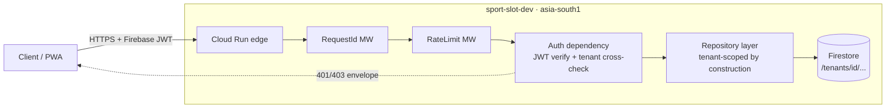

# SportSlotReservation

Multi-tenant SaaS for Indian residential community sports facility
booking. Built by [Chandra AI Labs](https://chandraailabs.com) as a
production-grade reference implementation: every architectural
decision documented, every phase independently validated.

**Status:** Phase 2 complete — backend foundation live (FastAPI on
Cloud Run, Firestore, Firebase Auth, 5-layer tenant isolation).

## Architecture



**Tenant isolation (ADR-0004), five layers:** deny-all Firestore
rules · repository pattern requiring TenantContext at construction ·
JWT-vs-subdomain cross-check middleware · automated cross-tenant
tests · CI static-analysis gates (Phase 5).

## Quickstart (local)

```bash
make install && make verify-env   # toolchain check (13 tools)
make dev-env                      # creates backend/.env from template
# → fill SPORTSLOT_WEB_API_KEY (Firebase Console → Project settings)
make seed-dev                     # demo Firebase user + profile (dev only)
make run-dev                      # uvicorn on :8000
TOKEN=$(./scripts/get_dev_token.sh demo-resident@chandraailabs.com '<password>')
curl -H "Authorization: Bearer $TOKEN" localhost:8000/api/v1/users/me
```

See `docs/runbooks/local-development.md` for the full loop and
known issues.

## Key documents

- `docs/adr/` — eight Architecture Decision Records (stack, data,
  tenant isolation, cost, API design, auth, data layout)
- `docs/security/charter.md` — principles, threat model, phased
  controls, DPDP compliance, identity & credential model
- `docs/retrospectives/phase-2.md` — what broke, why, and the
  rules we adopted because of it
- `CHANGELOG.md` — per-sub-phase history with phase tracker

## Stack

Python 3.12 · FastAPI · Firestore (Native) · Firebase Auth ·
Cloud Run · Cloud Build · Artifact Registry · uv · React 18 + Vite
(Phase 4) · Terraform · GitHub Actions + WIF (Phase 5)

## Engineering method

Three-agent protocol: a Strategist (Claude) designs and writes
execution prompts, a Worker (Claude Code) executes them, and a
human Coordinator approves designs, runs credentialed operations,
and validates every sub-phase independently in a fresh terminal.
Discussion-first; ADRs before code; no unverified completion claims.

## License

MIT © Chandra AI Labs
